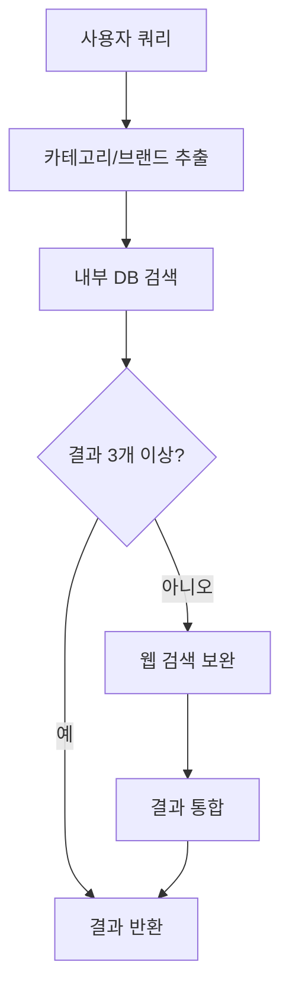
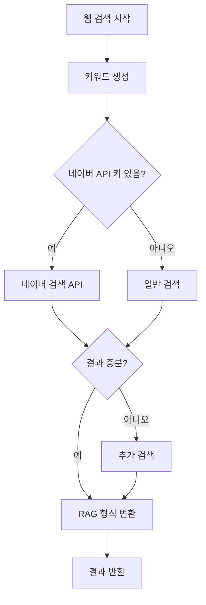

# 🌐 웹 검색 보완 기능 가이드

## 📋 개요

검색 결과가 3개 미만일 때 자동으로 웹 검색을 통해 결과를 보완하는 기능입니다.

## 🚀 주요 기능

### 1. 자동 웹 검색 보완

- **조건**: 내부 데이터베이스 검색 결과가 3개 미만
- **동작**: 자동으로 웹 검색을 실행하여 부족한 결과 보완
- **목표**: 최소 3-5개의 검색 결과 제공

### 2. 스마트 키워드 생성

```
사용자 쿼리: "스타벅스 혜택"
생성 키워드:
- "스타벅스 혜택"
- "카페 할인 혜택"
- "카페 쿠폰"
- "스타벅스 할인"
```

### 3. 다단계 검색 전략

1. **1차**: 네이버 검색 API (API 키 설정 시)
2. **2차**: 일반 웹 검색 (API 실패 시 대안)
3. **결과**: RAG 형식으로 통합 제공

## 🔧 설정 방법

### 1. 네이버 API 키 설정 (권장)

```bash
# .env 파일에 추가
NAVER_CLIENT_ID=your_naver_client_id
NAVER_CLIENT_SECRET=your_naver_client_secret
```

### 2. API 키 발급 방법

1. [네이버 개발자센터](https://developers.naver.com/) 접속
2. 로그인 후 "애플리케이션 등록" 클릭
3. 검색 API 선택
4. Client ID와 Client Secret 발급

### 3. 설정 확인

```bash
# 테스트 스크립트 실행
cd ec2/
python test_web_search.py
```

## 📊 기능 동작 과정

### 일반 검색 프로세스



### 웹 검색 보완 프로세스



## 🎯 사용 예시

### 예시 1: 데이터베이스 결과 부족

```json
{
  "query": "아마존 프라임 혜택",
  "results": [
    {
      "search_type": "web_search",
      "metadata": {
        "title": "아마존 프라임 멤버십 혜택 총정리",
        "source": "웹검색",
        "url": "https://example.com/amazon-prime"
      }
    }
  ],
  "web_search_used": true
}
```

### 예시 2: 충분한 내부 데이터

```json
{
  "query": "스타벅스 혜택",
  "results": [
    {
      "search_type": "vector",
      "metadata": {
        "title": "스타벅스 사이렌오더 적립",
        "source": "내부데이터"
      }
    }
  ],
  "web_search_used": false
}
```

## 🔍 검색 결과 구조

### 웹 검색 결과 형식

```json
{
  "id": "web_스타벅스혜택_0",
  "metadata": {
    "title": "스타벅스 할인 혜택 안내",
    "brand": "스타벅스",
    "category": "카페",
    "benefit_type": "웹검색",
    "discount_rate": "상세정보 확인 필요",
    "conditions": "웹사이트 확인 필요",
    "source": "웹검색",
    "url": "https://example.com/starbucks",
    "search_keyword": "스타벅스 혜택"
  },
  "document": "스타벅스 할인 혜택 안내. 멤버십 가입 시 다양한 혜택 제공",
  "similarity_score": 0.7,
  "search_type": "web_search"
}
```

## 📈 모니터링 및 로깅

### 로그 메시지 예시

```
🌐 검색 결과 부족 (1개) - 웹 검색으로 보완
🔍 웹 검색 키워드: ['스타벅스 혜택', '카페 할인 혜택']
🌐 웹 검색 완료: 2개 결과 획득
🔄 웹 검색 보완 후: 3개 결과
```

### API 응답에서 확인

```json
{
  "web_search_used": true,
  "search_strategy": {
    "categories_found": ["카페"],
    "brands_found": ["스타벅스"],
    "vector_search_used": true,
    "web_search_triggered": true
  }
}
```

## 🛠️ 고급 설정

### 1. 검색 임계값 변경

```python
# rag_system.py에서 수정
if len(final_results) < 3:  # 3에서 다른 값으로 변경
```

### 2. 웹 검색 키워드 수 조정

```python
# 최대 키워드 수 변경
for keyword in search_keywords[:2]:  # 2에서 다른 값으로 변경
```

### 3. 웹 검색 결과 수 조정

```python
# 웹 검색에서 가져올 결과 수
naver_results = self._search_naver_api(keyword, min(needed, 3))  # 3 변경
```

## 🚨 문제 해결

### 1. 웹 검색이 작동하지 않는 경우

```bash
# API 키 확인
echo $NAVER_CLIENT_ID
echo $NAVER_CLIENT_SECRET

# 테스트 실행
python test_web_search.py
```

### 2. 검색 결과가 부정확한 경우

- 키워드 생성 로직 확인
- 카테고리/브랜드 추출 정확도 점검
- 검색 API 응답 상태 확인

### 3. 성능 이슈

- 웹 검색 타임아웃 조정 (현재 10초)
- 동시 검색 키워드 수 제한
- 캐싱 기능 추가 고려

## 📊 테스트 방법

### 1. 자동 테스트

```bash
cd ec2/
python test_web_search.py
```

### 2. 수동 API 테스트

```bash
curl -X POST http://localhost/api/chat \
  -H "Content-Type: application/json" \
  -d '{"message": "아마존 프라임 혜택", "user_id": "test"}'
```

### 3. 웹 인터페이스 테스트

- `http://localhost/`에서 특수한 검색어 입력
- 응답에서 `web_search_used: true` 확인

## 🎉 기대 효과

1. **검색 결과 보장**: 항상 3개 이상의 검색 결과 제공
2. **최신 정보**: 웹에서 실시간 정보 수집
3. **사용자 만족도**: 빈 결과 대신 유용한 정보 제공
4. **시스템 신뢰도**: 데이터베이스 부족 상황 자동 해결

## 📝 개발 노트

- 웹 검색 결과는 similarity_score 0.5-0.7 범위로 설정
- 네이버 API 실패 시 일반 검색으로 자동 대체
- HTML 태그 자동 제거 및 텍스트 정리
- 브랜드/카테고리 자동 분류 및 태깅
